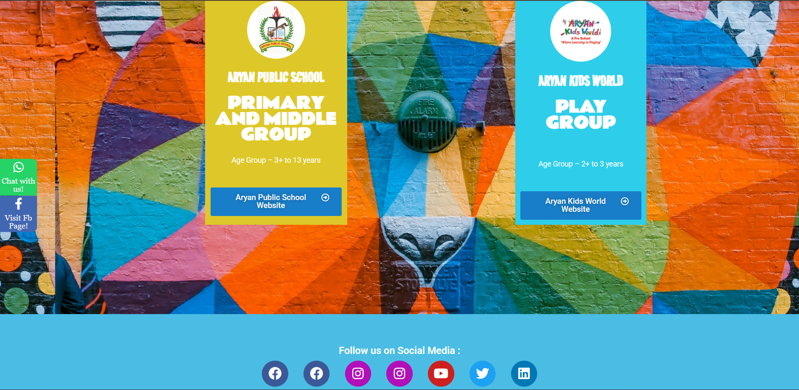
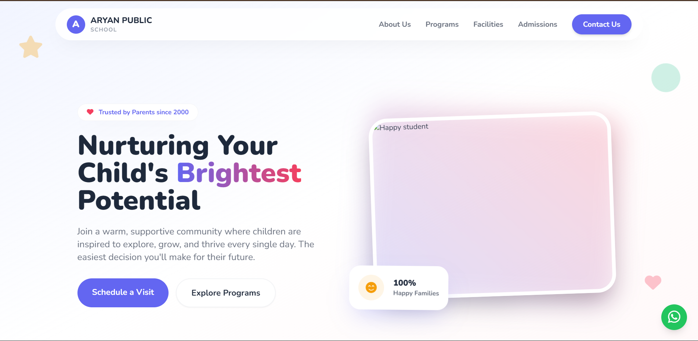

# Aryan Public School — Website Redesign

A ground-up redesign of the [Aryan Public School](https://www.aryanpublicschool.com/) website, rebuilt for a cleaner, modern experience.

**Live Preview → [v-humble-28.github.io/APS](https://v-humble-28.github.io/APS/)**

> ⚠️ **Status: Beta / Preview** — The site is live but actively being refined. Expect ongoing visual and structural updates.

---

## Overview

The original website lacked a modern visual identity and responsive design. This redesign addresses that by building a fresh interface from scratch — focusing on clarity, structure, and a professional aesthetic that better represents the school.

---

## Built With

- **HTML5**
- **CSS3**
- **JavaScript**
- **Google Antigravity**

---

## Screenshots

| Original | Redesign |
|----------|----------|
|  |  |

---

## Project Structure

```
APS/
├── index.html
├── assets/
│   ├── css/
│   ├── js/
│   └── images/
└── README.md
```

> *Update this tree to reflect your actual directory structure.*

---

## Getting Started

To run this project locally:

```bash
git clone https://github.com/v-humble-28/APS.git
cd APS
```

Then open `index.html` in your browser — no build step required.

---

## Roadmap

- [x] Initial redesign and layout
- [x] Deploy via GitHub Pages
- [ ] Refine responsive breakpoints
- [ ] Finalize copy and content sections
- [ ] Performance and accessibility audit

---

## Acknowledgements

- Original website: [aryanpublicschool.com](https://www.aryanpublicschool.com/)
- Built with assistance from AI tooling; all final edits and personalizations by [@v-humble-28](https://github.com/v-humble-28)
